Primero hago npm install.  
# GitHub Dependabot
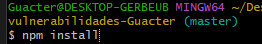  

Activo depensantbot y espero a que lea el fichero para que pueda detectar las alertas.  

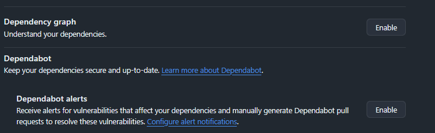  

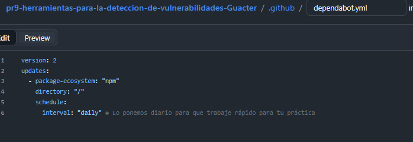  

Ya aparecen los mensajes:  

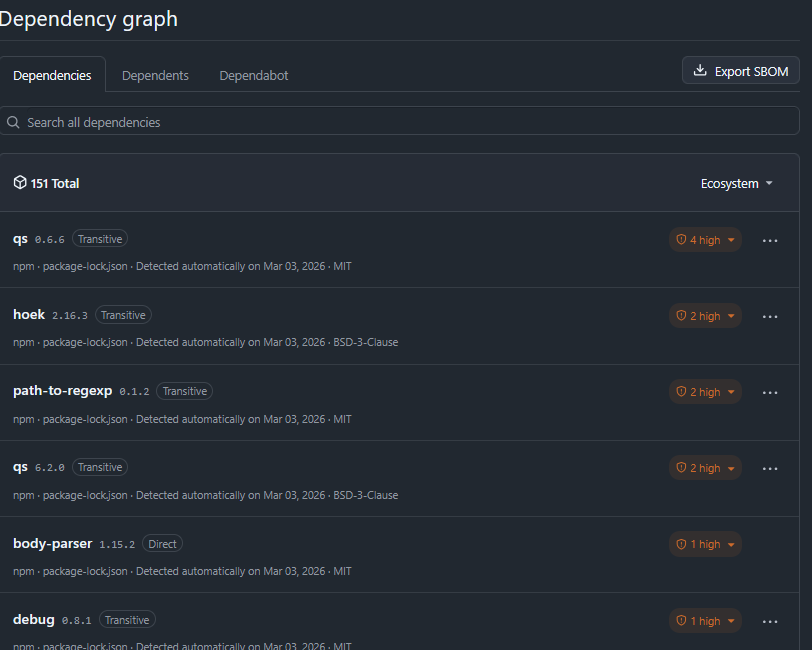  

### Comenta brevemente las vulnerabilidades que consideres que tienen más importancia.
- qs (versión 0.6.6 y 6.2.0): Presenta varias alertas de severidad Alta. Este paquete se encarga de parsear consultas URL. Podría permitir a un atacante inyectar propiedades en objetos globales de JavaScript y ejecutar código.
- hoek (versión 2.16.3): Su vulnerabilidad de nivel Alto generalmente se refiere a denegación de servicio (DoS) por un uso ineficiente de memoria
- path-to-regexp: Esta vulnerabilidad suele estar ligada a ReDoS (Regular Expression Denial of Service). Un atacante puede enviar una URL  que haga que la expresión regular tarde un tiempo indefinido en procesarse, dejando la web colgada.

# Renovate

Intalo primero la funcion:  
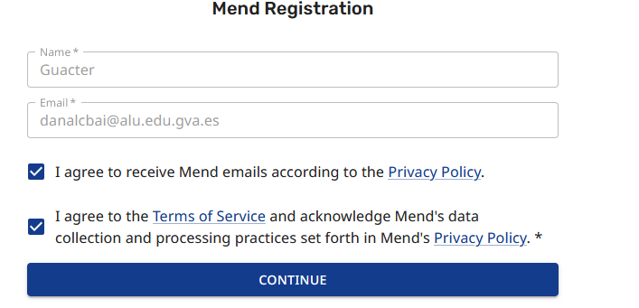

Ya pone las funciones que puedo actualziar:  
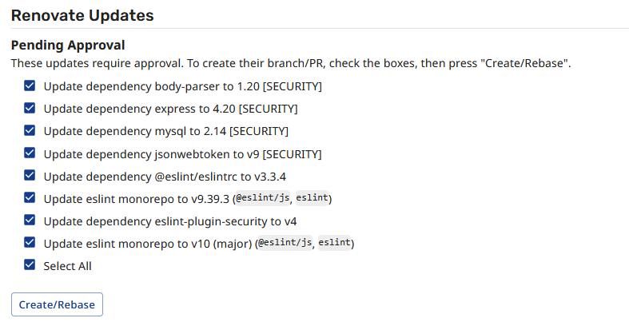

Ahora puedo ver el pull requests, incluidos los de dependantbot:  
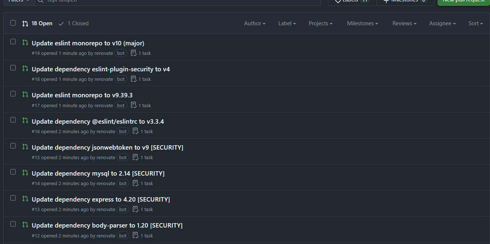  

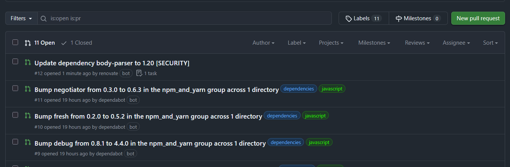

## Análisis de pull request

- eslint monorepo to v10 (major): Es una actualización mayor
- eslint-plugin-security to v4 : Es una actualización de versión de un plugin específico para ESLint que busca patrones de código inseguros

- eslint monorepo to v9.39.3:  Esta es una actualización de parche/menor dentro de la rama v9. A diferencia de la v10, esta es una actualización segura que corrige errores o añade pequeñas caracteríticas.
- mysql to 2.14 [SECURITY]: Esta es crítica. La etiqueta [SECURITY] indica que la versión que tienes instalada actualmente en tu proyecto tiene una vulnerabilidad conocida
- jsonwebtoken to v9 [SECURITY]: Similar a la anterior, pero en una librería  para la autenticación de usuarios. Se detectó un fallo en cómo se verificaban o firmaban los tokens en la versión anterior y esto lo corrige.

# eslint
Aqui tengo el comando de la ejecución del comando.  
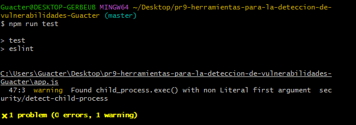

La ejecución finaliza con 1 problema ( 1 advertencia). Al ser una advertencia y no un error sigue ejecutando, pero avisa.
Detecta el uso de la función child_process.exec() con un primer argumento que no es un literal, lo que quiere decir que es una variable. 
Si esa variable contiene datos que provienen de un usuario y no se sanean correctamente, un atacante podría ejecutar comandos.

# SonarQube

Al instalar concedo acceso solo al repositorio de la practica, selecciono la versión gratuita y creo la organización.

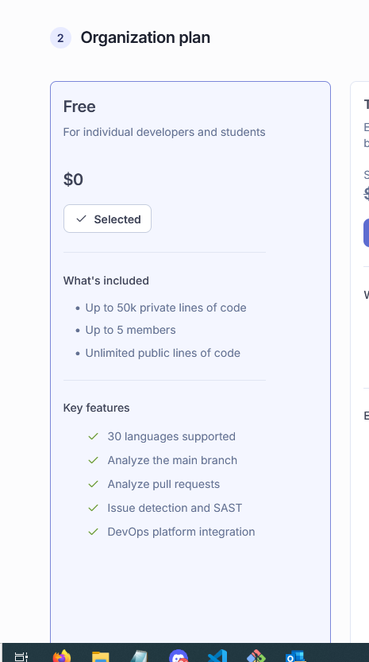  

Pongo el proyecto a analziar, luego marco previous version y creo el proyecto:  

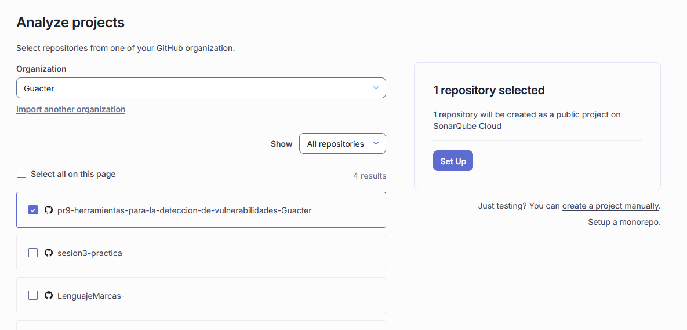  

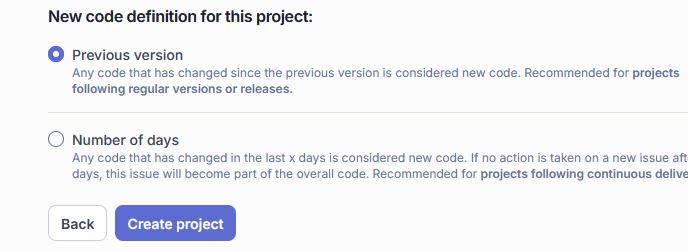

Espero, selecciono  manual  para hacer el ecaneo.  
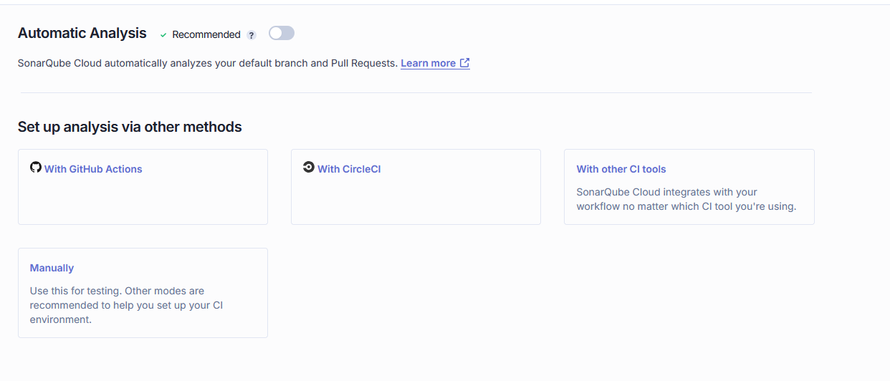

Sigo con la configuración (exporto la variable):  
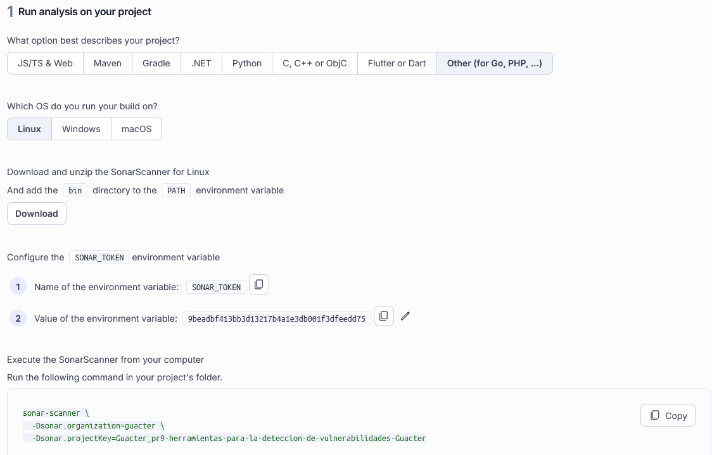

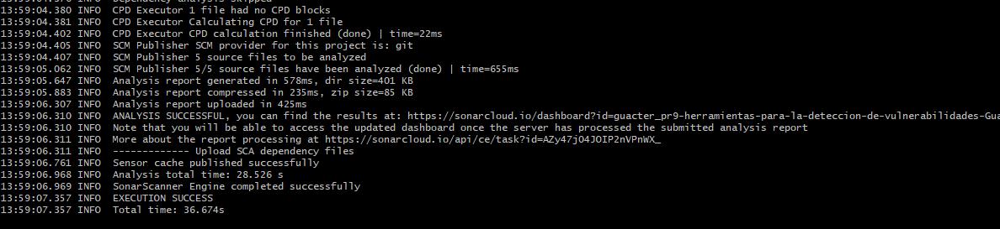

Al final puedo ver el conflcito:   

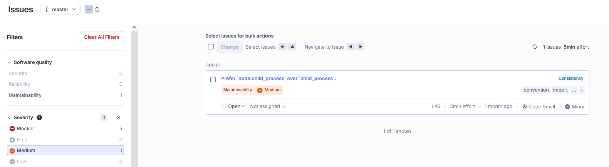  
El problema está en el código de la aplicación, específicamente en el archivo app.js, en la línea 46

# npm audit
Ejecuto:   
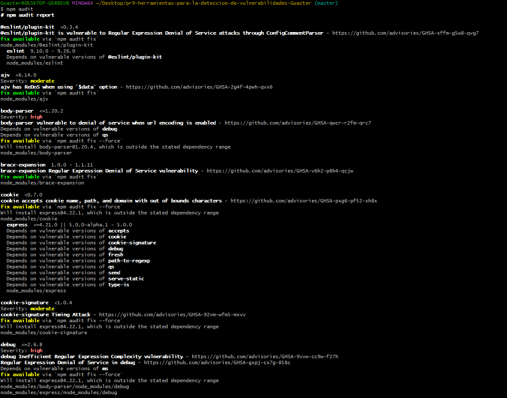  

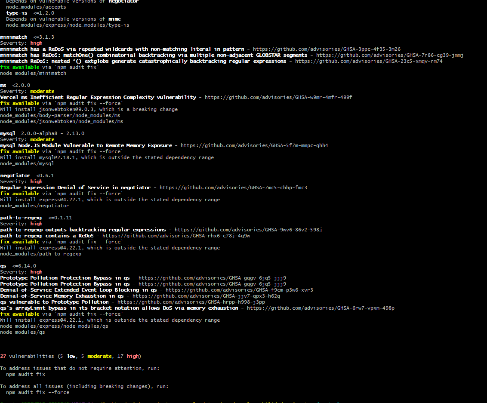

Hay 27 vulnerabilidades, de las cuales 17 son de alta severidad. Los altos son de DoS en body-parser, express, jsonwebtoken y path-to-regexp.. Los cinco moderados son de ataques de sincronización y exposición de memoria en mysql.

Se ejecutaria el comando npm audit fix.  
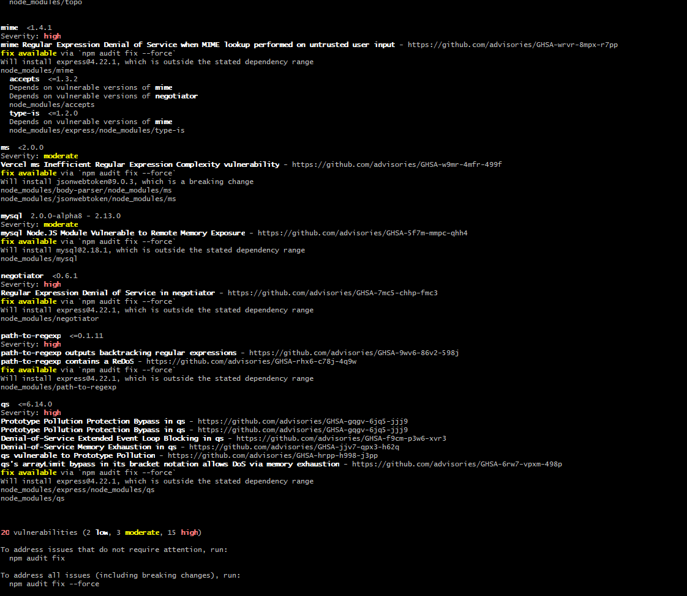  
Todavía  quedan 20 vulnerabilidades (15 de ellas de severidad alta). npm audit fix es conservador. Solo actualiza paquetes que no suponen un cambio drástico. Las vulnerabilidades que quedan requieren actualizar a versiones que npm considera arriesgadas para la estabilidad de tu código actual.

## 1. ¿Qué herramientas utilizarías para detectar librerías o dependencias vulnerables?
Usaria npm audit, GitHub Dependabot y Renovate. Estas herramientas se especializan en el análisis de composición del software.

## 2. ¿Qué herramientas utilizarías para detectar vulnerabilidades en el código propio del proyecto?
SonarQube y ESLint. Estas herramientas realizan análisis estático para encontrar fallos de seguridad en la lógica que se escribe .